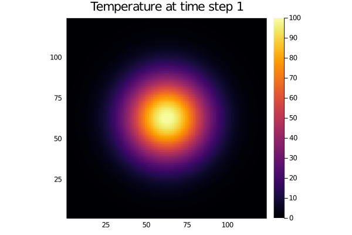

# Proof of Concept: a C-callable GPU-enabled parallel 2-D heat diffusion solver written in Julia using CUDA,  MPI and graphics

This is a Proof of Concept for writing dynamic libraries for C or other languages in Julia using CUDA, MPI and graphics. It extends [this Proof of Concept](https://github.com/simonbyrne/libcg) for serial applications by Dr. Simon Byrne (Caltech) and Dr. Viral B. Shah (Julia Computing Inc.) and reuses its shared library building framework to large parts. The building process relies on [PackageCompiler.jl].

It enables to compile a GPU-enabled parallel 2-D heat diffusion solver ([src/Diffusion.jl](src/Diffusion.jl)) written in Julia using [CUDA.jl], [MPI.jl], [ImplicitGlobalGrid.jl] and  [Plots.jl] in order to create a shared library that is callable from C (`libdiffusion.so`). Furthermore, it permits to build a C application ([main.c](main.c)) which uses this library. The application shows in particular that
- a GPU array allocated and initialized in the C code, and
- an MPI communicator created in the C code

can be passed in a straightforward and portable manner to the Julia solver for usage. In addition, the application showcases the usage of graphics features producing a simple animated GIF as the following:



The heat diffusion solver can naturally also be called from within the Julia runtime, enabling highly productive interactive development ([main_interactive.jl](main_interactive.jl) exemplifies this).


## Building and running on the Piz Daint supercomputer at the Swiss National Supercomputing Centre

The application can be built using a standard Julia installation on the home. It is built with the following instructions, dependencies being downloaded, built and installed automatically the first time:
```bash
module load daint-gpu
module switch PrgEnv-cray PrgEnv-gnu
module load cudatoolkit
cd <directory of repository>
make clean &&
  JULIA_MPICC=cc \
  JULIA_MPIEXEC=srun \
  JULIA_MPIEXEC_ARGS="-C gpu" \
  JULIA_MPI_PATH=$CRAY_MPICH_DIR \
  make > build.log
```
Then, it can be run, e.g., using four GPUs as follows:
```bash
JULIA_CUDA_USE_BINARYBUILDER=false srun -Cgpu -N4 -n4 main
```
It successfully uses **CUDA-aware MPI** leveraging Remote Direct Memory Access (RDMA) when it is run as follows:
```bash
export MPICH_RDMA_ENABLED_CUDA=1
export IGG_CUDAAWARE_MPI=1
JULIA_CUDA_USE_BINARYBUILDER=false srun -Cgpu -N4 -n4 main
```

The repository contains two recorded demos: [the first](demos/build_and_run.mp4) shows a successful build of the application on Piz Daint and its execution on four GPUs; [the second](demos/run_cuda_aware_mpi.mp4) shows a subsequent execution of the application with CUDA-aware MPI activated and the inspection of the produced animated GIF.


## Building on other systems

The Makefile requires the user to always set the following environment variables:
- `JULIA_MPICC`
- `JULIA_MPIEXEC`
- `JULIA_MPIEXEC_ARGS`

`JULIA_MPICC` defines the MPI wrapper compiler used to compile and link the main application ([main.c](main.c)) and to build the [MPI.jl] package. `JULIA_MPIEXEC` and `JULIA_MPIEXEC_ARGS` define the MPI launcher and arguments used to invoke [PackageCompiler.jl] with the required MPI context when building the shared library (`libdiffusion.so`). `JULIA_MPIEXEC` and `JULIA_MPIEXEC_ARGS` are also environment variables for the build of the [MPI.jl] package.

Furthermore, the Makefile automatically sets
```bash
JULIA_MPI_BINARY=system
```
for building the [MPI.jl] package. Depending on the system and the MPI implementation, the user needs to set additional environment variables to enable a correct build of the [MPI.jl] package. Please refer to the [corresponding section in the documentation of MPI.jl](https://juliaparallel.github.io/MPI.jl/latest/configuration/#environment_variables).

Finally, the user might need to set `CFLAGS` to include the CUDA include directory and `LDFLAGS` to link against the needed CUDA libraries (this is not needed on Piz Daint as there it is automatically handled by the Cray wrapper compiler).


[MPI.jl]: https://github.com/JuliaParallel/MPI.jl
[CUDA.jl]: https://github.com/JuliaGPU/CUDA.jl
[Plots.jl]: https://github.com/JuliaPlots/Plots.jl
[ImplicitGlobalGrid.jl]: https://github.com/eth-cscs/ImplicitGlobalGrid.jl
[PackageCompiler.jl]: https://github.com/JuliaLang/PackageCompiler.jl
